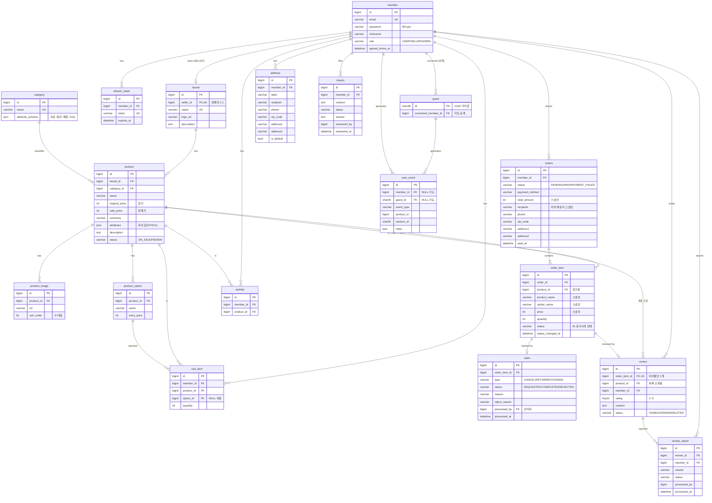

# 02. 데이터 모델(ERD) 명세

> 기준: 「기능 정의 - 이소희」 + [01 주문 상태 머신](01-order-state-machine.md)
> DB: MySQL 8.x (AWS RDS), utf8mb4 · InnoDB. JPA 엔티티는 이 문서의 테이블 정의를 그대로 따른다.
> 2026-07-09: 노션 「상품 참고」「로그 참고」(7/9 공유) 대조 설계 세션 — D8~D13 추가, `spec` 컬럼을 `attributes`로 개칭(D11).

## 1. 결정 로그

### D1. 주문 데이터는 스냅샷으로 저장한다 (파생값 금지 원칙의 예외가 아님)

- **문제**: order_item에 상품명/가격을 복사할지, product를 참조만 할지.
- **선택지**: (A) product FK 참조만 (B) 주문 시점 값 복사(스냅샷) + FK는 링크용으로만
- **기준**: 주문은 "그 시점에 일어난 사실의 기록". 상품 가격이 바뀌거나 상품이 내려가도 주문 내역·환불 금액은 변하면 안 된다.
- **선택**: (B). `order_item`에 `product_name`, `price`(주문 시점 판매가), `option_name`을 복사. product_id는 상세 이동 링크용으로만 유지.
- **트레이드오프**: 저장 공간 중복 — 무시 가능. "파생값 저장 금지"와 충돌하지 않음: 스냅샷은 현재 값에서 계산할 수 있는 파생값이 아니라 과거 사실이다.

### D2. 상품 옵션은 단일 옵션 그룹으로 단순화한다

- **문제**: 기능 정의에 "옵션·수량 선택"이 있다. 옵션을 어느 수준까지 모델링할지.
- **선택지**: (A) 다축 옵션(색상×사이즈 조합, SKU 매트릭스) (B) 단일 옵션 리스트(상품당 옵션 0~N개, 하나만 선택) (C) 옵션 없음
- **기준**: 기능 정의 요구("옵션 선택")를 만족하는 최소 모델 + 자연어 담기("파란색으로 담아줘")가 다뤄야 하는 복잡도.
- **선택**: (B). `product_option(id, product_id, name, extra_price)` — "블랙", "화이트 (+2,000원)" 식. 옵션 없는 상품은 옵션 행 0개, 장바구니/주문의 option_id는 nullable.
- **트레이드오프**: "색상+사이즈" 조합 표현 불가 → 시드 데이터에서 조합이 필요한 상품은 "블랙/M", "블랙/L"처럼 조합을 한 옵션 이름으로 풀어서 등록(운영 데이터로 우회, 스키마 확장 없이).

### D3. 최근 본 상품은 테이블을 만들지 않고 user_event를 재활용한다

- **문제**: 최근 본 상품 전용 테이블 vs 이벤트 로그 조회.
- **기준**: 같은 데이터를 두 곳에 쓰지 않는다. `PRODUCT_VIEW` 이벤트는 판매자 지표 때문에 어차피 적재한다.
- **선택**: `user_event`에서 `event_type=PRODUCT_VIEW` 최신순 + product 조인, 중복 상품 제거(최신 1건), 최대 20개.
- **트레이드오프**: 조회 쿼리가 전용 테이블보다 무겁다 → `(member_id, event_type, created_at)` 인덱스로 커버, 데모 규모에서 문제 없음.

### D4. 후기는 order_item과 1:1, 신고 처리는 상태 변경(soft)으로

- 후기 자격(배송완료·아이템당 1개)의 검증 앵커가 필요 → `review.order_item_id UNIQUE`. product_id/member_id는 조회용 중복 보관(조인 절약).
- 신고된 후기의 "숨김/삭제"(관리자)는 물리 삭제가 아니라 `review.status = VISIBLE/HIDDEN/DELETED`. 이유: 신고 처리 내역 화면이 처리된 후기를 계속 보여줘야 함.

### D5. 게스트는 UUID 쿠키 + guest 테이블로 추적한다 (횟수 제한 없음)

- **게스트 채팅 횟수 제한은 두지 않는다** (2026-07-07 팀 회의: "이 정도 loss는 감수" — 가입 전 이탈 방지 우선). 게스트는 무제한 채팅 가능하되 개인화만 미적용.
- guest 테이블은 카운트용이 아니라 **행동 이력(user_event)의 주체 식별 + 가입 시 승계**를 위해 유지: `guest(id UUID, converted_member_id)`.
- 가입/로그인 시 프론트가 guestId를 전달하면 `converted_member_id` 기록 + 해당 guest의 user_event를 member로 이관(UPDATE).

### D6. Refresh Token은 Redis가 아니라 DB 테이블에 저장한다

- **문제**: RT 저장소. Redis는 채팅 세션 TTL용으로 어차피 도입하는데 RT도 거기 둘지.
- **기준**: RT는 유일한 "잃어버리면 안 되는" 인증 상태(재로그인 강제됨). Redis는 데모 환경에서 재시작이 잦고 휘발돼도 되는 데이터(채팅 세션)만 두는 걸로 역할을 나눈다.
- **선택**: `refresh_token` 테이블. 로그아웃/재발급 시 row 삭제·교체.
- **트레이드오프**: 토큰 검증마다 DB 조회 — AT 검증은 서명만으로 하고 RT는 재발급 때만 조회하므로 부하 아님.

### D7. 상품 스펙은 JSON 컬럼 + 2단 검색 (EAV 대비 확정 — 2026-07-07)

- **문제**: 전 카테고리 상품의 스펙 축(소재/연결방식/피부타입…)이 제각각이다. 이걸 어떻게 저장하고, "린넨 소재만" 같은 자연어 조건 필터를 어디서 수행할지.
- **선택지**:
  - (A) `product.attributes JSON` + 2단 검색 — 서버는 문자열 LIKE로 후보만 좁히고, LLM이 attributes을 읽고 최종 선별
  - (B) EAV — `category_metadata_fields`(카테고리별 필드 "틀") + `product_metadata_values`(상품별 값 행). 서버가 `WHERE field='소재' AND value='린넨'`으로 정밀 필터
- **기준**: ① 스펙의 실소비자가 누구인가 — LLM(통째로 읽음)과 상세페이지 스펙 표(통째로 렌더)뿐, 필드 단위 SQL 소비자(필터 UI·등록 폼) 없음 ② 데이터 소스가 크롤링 — 소스마다 키·값이 자유 텍스트
- **선택**: (A). 근거 두 가지 —
  - **비용**: B는 크롤링 필드→field_id 매핑 ETL과 상품당 N행 조인이 즉시 발생
  - **이득 미실현**: B의 핵심 이득(서버 정밀 필터)은 값이 정규화돼야 성립하는데, 크롤링 값은 "린넨 100%"/"면 50% 린넨 50%" 같은 자유 텍스트라 결국 `value LIKE`로 후퇴 → JSON LIKE와 정확도가 같아짐
- **동작 방식 (구현 기준)**:
  - 검색 파라미터(I-1)는 **컬럼 축만**: keyword/category/가격/브랜드. 스펙 메타데이터는 파라미터(입력)가 아니라 **응답(출력)**으로 나간다 — LLM이 세밀 조건을 파라미터로 보내는 게 아니라, 후보의 attributes을 받아 읽고 거른다
  - 1차(DB): `name/summary LIKE + CAST(attributes AS CHAR) LIKE` — "글자가 있는 상품"을 놓치지 않고 수집(재현율). 인덱스 없는 풀스캔이지만 상품 수백 개 규모에서 무시 가능
  - 2차(LLM): 후보(≤30)의 attributes을 읽고 "의미가 맞는 상품"만 선별(정밀도)
- **전환 경로 (EAV로 가는 조건)**: ① 필드 단위 필터 UI 또는 카테고리 기반 상품 등록 폼이 로드맵에 오르고 ② 값 정규화(사전 구축)가 가능해지는 시점. 그때 B 구조(위 스키마)로 마이그레이션 — attributes JSON의 키를 순회해 행으로 옮기는 기계적 작업이라 전환 비용 낮음. 검색 성능이 먼저 병목이 되면(수만 상품) FULLTEXT 인덱스 → 검색엔진 순으로 중간 단계도 있음.

### D8. 재고는 모델링하지 않는다 (2026-07-09)

- **문제**: 「상품 참고」(7/9)에 `stock/availability`가 있고 03 §7의 담기 흐름도 "재고 검증"을 언급하는데, product 테이블에는 재고 컬럼이 없다 — 문서 간 모순. 재고를 모델링할지, 어느 수준까지 할지.
- **선택지**: (A) 재고 미모델링 — 전 상품 항상 구매 가능 (B) `product.stock` 표시용 컬럼(차감 없음) (C) 차감까지 — 주문 시 감소, 클레임 승인 시 복원, 동시성 제어
- **기준**: ① 기능 정의(MVP 기준 문서)에 재고/품절 요구가 있는가 — 없음. 상품 상세 요구는 이미지/가격/옵션·수량/스펙/리뷰/연관추천/브랜드뿐 ② 데모 가치 vs 리스크 — 추천받은 상품이 품절이면 핵심 플로우(추천→담기→구매)가 그 자리에서 막힘. 품절은 데모에서 가치가 아니라 리스크 ③ 소비처 — 판매자 MVP 지표(매출/조회수/담김수)에도 재고 없음.
- **선택**: (A). 판매 중지 표현이 필요하면 이미 있는 `product.status=HIDDEN`으로 커버(노출 자체를 끔). (B)는 아무도 안 읽는 컬럼(member OAuth와 같은 YAGNI 논리), (C)는 모의 결제에 실재고 정합이라는 비용 불일치.
- **트레이드오프**: 품절·재고 기반 시나리오 불가 — MVP 시나리오에 없음을 확인하고 감수. 고도화 시 `stock` 컬럼 추가 + 조건부 UPDATE(`SET stock=stock-n WHERE stock>=n`) 차감으로 확장 — 01 §6과 같은 패턴이라 분산 3대에서도 안전. 03 §7의 "재고" 문구는 이 결정에 맞춰 정정함.

### D9. 평점 평균·리뷰 수는 반정규화하지 않는다 (「상품 참고」와 의도적 상이 — 2026-07-09)

- **문제**: 「상품 참고」는 `rating_avg`/`review_count`/`total_review_count`를 product 고정 컬럼(자주 필터/정렬)으로 제안. 현행 원칙은 파생값 저장 금지(조회 시 집계).
- **선택지**: (A) 조회 시 review 집계(현행) (B) product에 반정규화 컬럼 + 리뷰 쓰기 시 갱신
- **기준**: ① 규모 — 상품 300+·리뷰 수천(시드) 수준에서 페이지당 20개 서브쿼리 집계는 ms 단위 ② 정합 비용 — (B)는 리뷰 등록/숨김(HIDDEN)/삭제(DELETED) 3개 경로 전부에 갱신 로직이 필요, 하나라도 새면 조용히 drift(JPA 벌크 연산·동시 쓰기에서 특히) ③ 정렬 소비처 실재 — 인기 신호(브랜드 홈 인기순, 인기 상품 P-4)는 평점이 아니라 판매·조회(order_item, user_event) 집계로 이미 정의됨. 평점은 카드·상세 **표시용**뿐, 평점 정렬/필터 UI 없음.
- **선택**: (A) 유지. 「상품 참고」의 전제(수만 상품 + 필드 단위 필터·정렬 UI)가 우리 MVP에 없음 — 참고 문서와 다르게 가는 근거를 남긴다.
- **트레이드오프**: 상품 목록 조회마다 집계 조인 비용 → 페이지네이션(≤30)으로 상수 규모 유지. 병목이 실측되면 그때 컬럼 추가 + backfill 1쿼리로 전환(전환 비용 낮음).

### D10. 카테고리는 flat 1단을 유지한다 (2026-07-09)

- **문제**: 「상품 참고」의 `category_no`는 "중분류/소분류"를 가리킴(계층 전제). 현행 category는 name만 있는 flat.
- **선택지**: (A) flat 유지 (B) `parent_id` 자기참조 계층
- **기준**: 소비처 — 메인 카테고리 목록(클릭→채팅 검색), 브랜드 홈 카테고리 필터, LLM 검색 파라미터(I-1 `categoryName`). 전부 "카테고리 1개 지정"으로 충분하고 계층 브라우징 UI가 없음. 시드 규모도 8~12개 — 계층으로 나눌 폭이 아님.
- **선택**: (A). 크롤링 소스가 중/소분류 구조로 오면 **소분류를 우리 카테고리로 평탄화**해 매핑(시드 단계에서 처리, 스키마 무관).
- **트레이드오프**: "패션 > 남성 > 셔츠" 식 트리 탐색 불가 — 해당 화면이 MVP에 없음. 필요 시 `parent_id` 컬럼 1개 추가로 확장(기존 행은 그대로 루트가 됨).

### D11. 카테고리가 속성 축을 정의한다 — `category.attribute_schema` + `spec`→`attributes` 개칭 (2026-07-09)

- **문제**: 「상품 참고」의 attributes는 "그 카테고리 상품이라면 공통으로 갖는 속성 축"(의류=소재/색상/사이즈/기장…)이다. D7은 값의 **저장 방식**(JSON vs EAV)만 확정했고, "축의 정의는 카테고리 소관"이라는 도메인 사실이 스키마 어디에도 없다. 축의 정의를 어디에 둘지 + 컬럼 네이밍.
- **선택지**:
  - (A) 현행 — `product.attributes` 자유 스키마, 축은 암묵(시드 문서로만 존재)
  - (B) `category.attribute_schema JSON` — 카테고리 행에 축(키 목록) 저장, 서버 검증은 안 함(soft schema)
  - (C) `category_attribute` 별도 테이블 — EAV의 절반(D7에서 기각한 방향으로의 후퇴)
- **기준**: ① 축 정의의 소비자가 실재하는가 — (i) **시드 생성**: 카테고리당 수십 상품을 LLM팀과 만들 때 축 계약이 없으면 같은 카테고리 안에서 키가 제각각 → 2단 검색(D7)의 LLM 선별 품질에 직결 (ii) **LLM 조건 추출**: "린넨 소재 이불" → 그 카테고리의 축을 알면 조건 추출·선별 프롬프트가 정확해짐 (iii) **판매자 상품 수정(S-3)**: 축이 있어야 수정 폼을 그릴 수 있음(자유 JSON 편집은 UX가 아님) ② D7 정신(값은 자유 텍스트, 서버 정밀 필터 없음)과 충돌하지 않는가 — 축은 "키 목록" 수준이므로 충돌 없음 ③ 비용 — JSON 컬럼 1개.
- **선택**: (B). 형식은 단순 키 배열 `["소재","색상","사이즈"]`로 시작(예시값이 필요해지면 객체로 확장). 서버는 저장 시 검증하지 않는다 — 크롤링 값의 자유 텍스트를 그대로 수용(D7 유지). **네이밍은 `spec` → `attributes`로 개칭**: 팀 공용 참고 문서(「상품 참고」)와 어휘를 통일해 LLM팀과의 시드·계약 논의가 한 단어로 진행되게 함. 구현 전이라 rename 비용 0 (03/04/05의 spec 표기도 함께 정정).
- **트레이드오프**: `attribute_schema`와 `product.attributes` 간 drift 가능(서버 미검증) → 감수 방법: 시드 파이프라인이 schema를 읽어 상품을 생성(생성 시점 정합 보장), 판매자 수정 폼도 schema 기반 렌더. drift가 나도 최종 소비자(LLM)는 자유 텍스트를 읽으므로 기능이 죽지 않고 품질만 하락 — 저위험.

### D12. 로그는 user_event 단일 테이블을 유지한다 (「로그 참고」 대조 — 2026-07-09)

- **문제**: 「로그 참고」(7/9)는 로그 4종(`user_event_log`/`session_log`/`admin_event_log`/`login_history`)과 범용 스키마(`target_type`/`target_id`/`event_result`/`duration_ms`)를 제안. 현행은 `user_event` 1개(5개 타입, product_id 특화). 어디까지 수용할지.
- **기준**: ① MVP 소비처 — 판매자 페이지는 MVP에서 "지표 조회 수준"(기획서), AI 분석 4종(매출 이상/전환율/행동/이탈)은 고도화(7/31) 구간 ② 대화·세션 미저장 정책(03)과의 충돌 여부 ③ append-only 테이블은 나중에 타입·meta 확장이 무마이그레이션이라, "미리 넓게"의 이득이 작음.
- **테이블별 판단**:
  - `session_log` — **미도입**. 채팅 세션은 Redis TTL 휘발(D6·03 확정), 대화 미저장 정책과 정면 충돌. 고도화의 이탈 분석이 세션 경계를 요구하면 CHAT_QUERY meta의 sessionId로 재구성하거나 그때 도입.
  - `admin_event_log` — **미도입**. 관리자 페이지 자체가 MVP 제외. 고도화의 "관리자 질문형 에이전트"가 필요로 하는 시점에 참고 문서 스키마(before/after JSON) 그대로 추가 가능.
  - `login_history` — **미도입**. 이상 로그인 탐지는 MVP 기능이 아님. 필요 시 user_event에 LOGIN 타입 추가로도 흡수 가능.
  - `user_event` 범용화(target_type/target_id/event_result/duration_ms 컬럼) — **미수용**. 판매자 MVP 지표의 축은 전부 상품이므로 `product_id` 특화 컬럼+인덱스가 직접적. 체류시간·결과 같은 부가정보는 `meta JSON`이 스키마 변경 없이 흡수.
- **선택**: 현행 user_event 유지. 「로그 참고」는 고도화 확장의 **로드맵**으로 취급.
- **트레이드오프**: 고도화 AI 분석이 요구하는 데이터 밀도(체류시간, 세션 퍼널)가 MVP 기간에 실데이터로 쌓이지 않음 → 감수 방법: 어차피 데모 데이터는 시드 — 고도화 시작 시 확장 타입의 과거분 이벤트를 시드로 함께 생성. 타입 추가는 append-only라 과거 데이터 소급이 필요 없음.

### D13. 개인화 프로필 테이블은 BE ERD에 없다 (05 원칙 재확인 — 2026-07-09)

- 기능 정의의 "대화 기반 프로필 갱신 → 홈 개인화 추천"은 **데이터 소유가 LLM 팀**(05 계약 원칙: "개인화 프로필은 LLM 팀 소유"). BE는 P-5에서 FastAPI 추천 API를 호출하는 소비자일 뿐, 프로필 스키마를 갖지 않는다 — ERD에 프로필 테이블이 없는 것은 누락이 아니라 결정.
- 저장 시점·형식은 05 §4 OPEN. 합의가 "BE DB 저장"으로 뒤집히면 `member_profile(member_id UNIQUE, preferences JSON)` 1테이블 추가로 수용(확장 경로 확보).

---

## 2. ERD

공통 컬럼(`created_at`, 변경 테이블의 `updated_at`)은 다이어그램에서 생략. PK는 전부 `id BIGINT AUTO_INCREMENT`(guest만 UUID).

## 3. 테이블 정의

공통: PK는 `id BIGINT AUTO_INCREMENT`(guest 제외). 모든 테이블에 `created_at DATETIME NOT NULL`, 변경이 있는 테이블에 `updated_at`. FK는 명시하되 ON DELETE는 전부 RESTRICT(운영 데이터 보호, 데모에서 삭제 기능 자체가 거의 없음).

JPA 매핑 규약: PK 생성은 `IDENTITY` 전략(MySQL AUTO_INCREMENT 대응 — RDS에서 시퀀스 없음). 상태·역할·타입 컬럼은 enum + `@Enumerated(STRING)`(VARCHAR 정의와 1:1). JSON 컬럼(`attributes`, `attribute_schema`, `meta`)은 `@JdbcTypeCode(SqlTypes.JSON)`(Hibernate 6)로 매핑 — 서버는 파싱만 하고 스키마 검증하지 않는다(D7·D11).

### member
| 컬럼 | 타입 | 제약 | 비고 |
|---|---|---|---|
| email | VARCHAR(255) | UNIQUE, NOT NULL | |
| password | VARCHAR(255) | NOT NULL | BCrypt |
| nickname | VARCHAR(50) | NOT NULL | |
| role | VARCHAR(20) | NOT NULL | `USER` / `SELLER` / `ADMIN` |
| agreed_terms_at | DATETIME | NOT NULL | 약관 동의 시각 |

- **OAuth는 MVP 제외** (2026-07-07 팀 결정). 고도화에서 도입 시 `provider`/`provider_id` 컬럼 추가 + `password` NULL 허용으로 확장 — 지금 컬럼을 미리 두지 않는 이유: 쓰지 않는 nullable 컬럼은 검증 로직만 흐리게 함(YAGNI).

- SELLER/ADMIN은 시드 전용(가입 API로 생성 불가). SELLER는 brand.seller_id로 브랜드와 1:1.

### guest
| 컬럼 | 타입 | 제약 | 비고 |
|---|---|---|---|
| id | CHAR(36) | PK | UUID, 쿠키 값 그대로 |
| converted_member_id | BIGINT | NULL, FK(member) | 가입/로그인 승계 시 기록 |

### refresh_token
| 컬럼 | 타입 | 제약 |
|---|---|---|
| member_id | BIGINT | FK(member), NOT NULL |
| token | VARCHAR(512) | UNIQUE, NOT NULL |
| expires_at | DATETIME | NOT NULL |

### brand
| 컬럼 | 타입 | 제약 | 비고 |
|---|---|---|---|
| seller_id | BIGINT | FK(member), UNIQUE, NOT NULL | 판매자 1명 = 브랜드 1개 |
| name | VARCHAR(100) | UNIQUE, NOT NULL | |
| logo_url | VARCHAR(500) | NULL | |
| description | TEXT | NULL | |

### category
| 컬럼 | 타입 | 제약 | 비고 |
|---|---|---|---|
| name | VARCHAR(50) | UNIQUE, NOT NULL | 메인 해시태그 = 이 테이블 전체 조회 |
| attribute_schema | JSON | NULL | 이 카테고리 상품의 속성 축(키 배열, 예: `["소재","색상","사이즈"]`) — D11. 서버 검증 없음(soft), 시드 생성·판매자 수정 폼·LLM 프롬프트가 소비 |

- flat 1단 유지(D10) — 계층 필요 시 `parent_id` 추가로 확장.

### product
| 컬럼 | 타입 | 제약 | 비고 |
|---|---|---|---|
| brand_id | BIGINT | FK(brand), NOT NULL | |
| category_id | BIGINT | FK(category), NOT NULL | |
| name | VARCHAR(200) | NOT NULL | |
| original_price | INT | NOT NULL | 정가 (KRW, 원 단위 정수) |
| sale_price | INT | NOT NULL | 판매가. 할인율은 파생 계산(저장 금지) |
| summary | VARCHAR(500) | NULL | 주요 특징 요약 |
| attributes | JSON | NULL | 카테고리 속성 축의 값 — 키 축은 `category.attribute_schema`(D11), 값은 자유 텍스트(D7). 재고 컬럼은 의도적으로 없음(D8) |
| description | TEXT | NULL | 상세 설명 |
| status | VARCHAR(20) | NOT NULL | `ON_SALE` / `HIDDEN` — 판매자 상세 수정·비노출용 |

- 인덱스: `(category_id)`, `(brand_id)`, FULLTEXT 없음(LIKE 검색으로 시작, D7).

### product_image
| 컬럼 | 타입 | 제약 | 비고 |
|---|---|---|---|
| product_id | BIGINT | FK(product), NOT NULL | |
| url | VARCHAR(500) | NOT NULL | |
| sort_order | INT | NOT NULL DEFAULT 0 | 0번이 대표 이미지 |

### product_option
| 컬럼 | 타입 | 제약 | 비고 |
|---|---|---|---|
| product_id | BIGINT | FK(product), NOT NULL | |
| name | VARCHAR(100) | NOT NULL | 예: "화이트", "블랙/M" (D2) |
| extra_price | INT | NOT NULL DEFAULT 0 | 옵션 추가금 |

### cart_item
| 컬럼 | 타입 | 제약 | 비고 |
|---|---|---|---|
| member_id | BIGINT | FK(member), NOT NULL | 게스트 장바구니 없음(담기는 로그인 필요) |
| product_id | BIGINT | FK(product), NOT NULL | |
| option_id | BIGINT | FK(product_option), NULL | 옵션 없는 상품은 NULL |
| quantity | INT | NOT NULL, CHECK > 0 | |

- UNIQUE(member_id, product_id, option_id) — 같은 상품+옵션 재담기는 수량 증가로 처리.
- **MySQL 주의**: UNIQUE 인덱스는 NULL을 중복 허용하므로 option_id=NULL(무옵션 상품)엔 이 제약이 걸리지 않는다 → 서비스 레이어의 "조회 후 수량 증가" upsert가 실질 방어선. 동시 요청으로 중복 행이 생겨도 기능상 무해(목록에 2행 표시)라 감수 — 스키마로 막으려면 option_id NOT NULL + 센티널(0)이 필요한데 FK 무결성을 깨는 비용이 더 큼.
- 가격은 저장하지 않는다(장바구니는 현재가 표시 — 스냅샷은 주문 시점에만).

### address
| 컬럼 | 타입 | 제약 | 비고 |
|---|---|---|---|
| member_id | BIGINT | FK(member), NOT NULL | |
| label | VARCHAR(50) | NOT NULL | "집", "회사" |
| recipient | VARCHAR(50) | NOT NULL | 수령인 |
| phone | VARCHAR(20) | NOT NULL | |
| zip_code | VARCHAR(10) | NOT NULL | |
| address1 / address2 | VARCHAR(255) / VARCHAR(255) | NOT NULL / NULL | |
| is_default | BOOLEAN | NOT NULL DEFAULT false | 회원당 1개 — 서비스 레이어에서 보장 |

### orders  (`order`는 SQL 예약어라 복수형)
| 컬럼 | 타입 | 제약 | 비고 |
|---|---|---|---|
| member_id | BIGINT | FK(member), NOT NULL | |
| status | VARCHAR(20) | NOT NULL | `PENDING` / `PAID` / `PAYMENT_FAILED` (01 문서) |
| payment_method | VARCHAR(30) | NOT NULL | `MOCK_CARD` / `MOCK_FAIL` 등 |
| total_amount | INT | NOT NULL | 주문 시점 합계 스냅샷 (D1) |
| recipient / phone / zip_code / address1 / address2 | 주소와 동일 | NOT NULL(address2 제외) | 배송지 스냅샷 — address FK 아님(주소 수정·삭제돼도 주문 보존) |
| paid_at | DATETIME | NULL | |

### order_item
| 컬럼 | 타입 | 제약 | 비고 |
|---|---|---|---|
| order_id | BIGINT | FK(orders), NOT NULL | |
| product_id | BIGINT | FK(product), NOT NULL | 상세 링크용 |
| product_name | VARCHAR(200) | NOT NULL | 스냅샷 |
| option_name | VARCHAR(100) | NULL | 스냅샷 |
| price | INT | NOT NULL | 스냅샷: sale_price + extra_price |
| quantity | INT | NOT NULL | |
| status | VARCHAR(30) | NOT NULL | 01 문서의 9개 상태 |
| status_changed_at | DATETIME | NOT NULL | 스케줄러 전이 기준 시각 |

- 인덱스: `(status, status_changed_at)` — 배송 전이 스케줄러 스캔용.

### claim
| 컬럼 | 타입 | 제약 | 비고 |
|---|---|---|---|
| order_item_id | BIGINT | FK(order_item), NOT NULL | REQUESTED 1개 제한은 서비스 검증 |
| type | VARCHAR(20) | NOT NULL | `CANCEL` / `RETURN` / `EXCHANGE` |
| status | VARCHAR(20) | NOT NULL | `REQUESTED` / `COMPLETED` / `REJECTED` |
| reason | VARCHAR(500) | NULL | 신청 사유 |
| reject_reason | VARCHAR(500) | NULL | 거절 시 필수 |
| processed_by | BIGINT | FK(member), NULL | 처리 관리자 |
| processed_at | DATETIME | NULL | |

### review
| 컬럼 | 타입 | 제약 | 비고 |
|---|---|---|---|
| order_item_id | BIGINT | FK(order_item), UNIQUE, NOT NULL | 아이템당 1개 (D4) |
| product_id | BIGINT | FK(product), NOT NULL | 상품 후기 목록 조회용 |
| member_id | BIGINT | FK(member), NOT NULL | |
| rating | TINYINT | NOT NULL, 1~5 | |
| content | TEXT | NOT NULL | |
| status | VARCHAR(20) | NOT NULL DEFAULT 'VISIBLE' | `VISIBLE` / `HIDDEN` / `DELETED` (D4) |

- 평점 통계(평균·개수)는 저장하지 않고 조회 시 집계(파생값 금지). 성능 문제가 생기면 그때 캐시.

### review_report
| 컬럼 | 타입 | 제약 | 비고 |
|---|---|---|---|
| review_id | BIGINT | FK(review), NOT NULL | |
| reporter_id | BIGINT | FK(member), NOT NULL | UNIQUE(review_id, reporter_id) — 중복 신고 방지 |
| reason | VARCHAR(500) | NOT NULL | |
| status | VARCHAR(20) | NOT NULL DEFAULT 'PENDING' | `PENDING` / `IN_PROGRESS` / `DONE` |
| processed_by / processed_at | BIGINT / DATETIME | NULL | |

### wishlist
| 컬럼 | 타입 | 제약 |
|---|---|---|
| member_id | BIGINT | FK(member), NOT NULL |
| product_id | BIGINT | FK(product), NOT NULL |
- UNIQUE(member_id, product_id)

### inquiry
| 컬럼 | 타입 | 제약 | 비고 |
|---|---|---|---|
| member_id | BIGINT | FK(member), NOT NULL | 접수는 로그인 사용자만(기능 정의 9번) |
| content | TEXT | NOT NULL | 챗봇이 정리한 문의 내용 |
| status | VARCHAR(20) | NOT NULL DEFAULT 'PENDING' | `PENDING` / `IN_PROGRESS` / `DONE` |
| answer | TEXT | NULL | 관리자 답변 |
| answered_by / answered_at | BIGINT / DATETIME | NULL | |

### user_event
| 컬럼 | 타입 | 제약 | 비고 |
|---|---|---|---|
| member_id | BIGINT | FK(member), NULL | 로그인 사용자 |
| guest_id | CHAR(36) | NULL | 비로그인. member/guest 중 하나는 NOT NULL(서비스 검증) |
| event_type | VARCHAR(30) | NOT NULL | §4 이벤트 타입 |
| product_id | BIGINT | NULL | 상품 관련 이벤트만 |
| session_id | CHAR(36) | NULL | 채팅 이벤트만 |
| meta | JSON | NULL | 타입별 부가정보 |

- 인덱스: `(member_id, event_type, created_at)` — 최근 본 상품(D3), `(product_id, event_type, created_at)` — 판매자 지표.
- 이 테이블은 UPDATE/DELETE 없음(append-only).

## 4. user_event 이벤트 타입 (퍼널 정의)

| event_type | 시점 | meta |
|---|---|---|
| `PRODUCT_VIEW` | 상세 진입 | — |
| `CART_ADD` | 담기(수동/챗봇) | `{ "via": "manual" \| "chat" }` — 챗봇 경유 담기 비율은 데모 어필 지표 |
| `ORDER_CREATED` | 결제 성공 | `{ "orderId": n, "amount": n }` |
| `CHAT_QUERY` | 채팅 질문 1건 | `{ "sessionId": "..." }` |
| `WISHLIST_ADD` | 찜 | — |

퍼널: `PRODUCT_VIEW → CART_ADD → ORDER_CREATED`. 판매자 지표(조회수/담김수/판매수)와 이탈 분석이 전부 이 세 타입으로 계산된다. **결제 성공 시 ORDER_CREATED를 아이템별이 아니라 주문 1건으로 적재**하고, 아이템별 판매 수량은 order_item에서 직접 집계한다(이벤트와 정산 데이터의 역할 분리).

## 5. 시드 데이터 요구사항 (LLM팀 공동 안건)

- 카테고리 8~12개(전 카테고리 컨셉이 보이는 폭), 브랜드 15~30개, 상품 300개 이상(추천 후보가 카테고리당 수십 개는 있어야 추천이 그럴듯함)
- 카테고리마다 `attribute_schema`(속성 축)를 먼저 확정하고, 그 카테고리 상품의 `attributes`는 반드시 그 축의 키로 채울 것(D11 — 시드 단계가 정합의 보장 지점)
- 상품마다 `summary`+`attributes`를 채울 것 — LLM 추천 품질이 이 텍스트 밀도에 좌우됨
- 옵션 상품과 무옵션 상품 혼재, 할인 상품(원가>판매가) 일부 포함
- 판매자 계정 2~3개는 특정 브랜드에 연결하고, 그 브랜드 상품에 user_event 더미를 깔아 판매자 대시보드가 첫 시연부터 그럴듯하게 보이게
- 형식: `data.sql` 또는 CSV+로더. **스키마 확정 후 LLM팀과 생성 방식 협의**

## 6. 구현 체크리스트

- [ ] 모든 API 응답이 엔티티가 아니라 DTO인가 (CLAUDE.md 규칙)
- [ ] order/order_item에 스냅샷 컬럼이 채워지는가 (product 조인으로 가격 계산하는 코드가 없어야 함)
- [ ] 할인율·평점 평균·주문 대표 상태를 저장하는 컬럼이 어디에도 없는가
- [ ] user_event 적재가 요청 응답을 막지 않는가 (@Async 또는 이벤트 리스너)
- [ ] guest → member 승계 시 user_event의 member_id가 채워지는가
- [ ] 시드 상품의 attributes 키가 소속 category.attribute_schema와 일치하는가 (D11)
- [ ] 재고·품절을 전제한 코드가 없는가 — 판매 중지는 product.status=HIDDEN뿐 (D8)

## 7. 기능 커버리지 매트릭스 (2026-07-09 전체 검토 결과)

기능 정의(MVP = 관리자 페이지 제외 전부) 대비 스키마 커버리지. 검토 시 이 표에서 빈 칸이 생기면 설계 누락이다.

| 기능 정의 | 지원 테이블 / 메커니즘 |
|---|---|
| 1 로그인/회원가입 | member, refresh_token, guest(가입 시 승계 D5) |
| 2 메인(홈) | category(해시태그), 개인화 추천=FastAPI(D13) + 인기 상품=user_event·order_item 집계, 예시 칩=정적 |
| 3 챗봇(검색) | 대화=Redis 세션(비영속, 03) — 테이블 없음(의도), user_event(CHAT_QUERY), attributes 2단 검색(D7·D11), 챗봇 담기=cart_item |
| 4 상품 상세 | product, product_image, product_option, review(평점 통계는 파생 D9), 연관 추천=05 OPEN(BE 규칙 기반이면 category+집계로 충분) |
| 5 브랜드 홈 | brand, product(정렬은 집계 파생 D9) |
| 6 장바구니 | cart_item(현재가 표시 — 스냅샷 없음, 의도) |
| 7 결제 | orders(배송지·금액 스냅샷 D1, 상태 01 §2-1), order_item(01 §2-2), 모의 결제(01 D7) |
| 8 마이페이지 | orders·order_item(주문 내역), claim(취소·반품·교환), user_event(최근 본 상품 D3), wishlist(찜), address(배송지), inquiry(문의 내역) |
| 9 문의 챗봇 | inquiry(접수), 주문 상태 답변=01 §4 파생 규칙(저장 안 함) |
| 10 판매자 페이지 | brand.seller_id(권한 유도), 지표=order_item·user_event 집계, 상품 수정=product(S-3) |
| (11 관리자 — MVP 제외) | 스키마는 이미 수용: claim·review_report·inquiry의 처리 상태/처리자 컬럼 — 관리자 API만 고도화로 미룸 |

프로필·세션·재고·평점컬럼이 ERD에 **없는 것**은 각각 D13·D12·D8·D9의 결정임 — 누락으로 오인하지 말 것.
