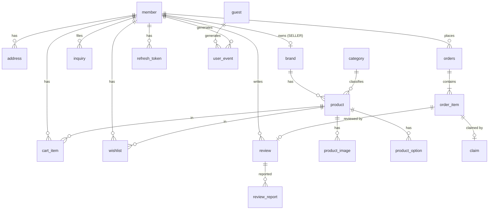

# 02. 데이터 모델(ERD) 명세

> 기준: 「기능 정의 - 이소희」 + [01 주문 상태 머신](01-order-state-machine.md)
> DB: MySQL 8.x, utf8mb4. JPA 엔티티는 이 문서의 테이블 정의를 그대로 따른다.

## 1. 결정 로그

### D1. 주문 데이터는 스냅샷으로 저장한다 (파생값 금지 원칙의 예외가 아님)

- **문제**: order_item에 상품명/가격을 복사할지, product를 참조만 할지.
- **선택지**: (A) product FK 참조만 (B) 주문 시점 값 복사(스냅샷) + FK는 링크용으로만
- **기준**: 주문은 "그 시점에 일어난 사실의 기록". 상품 가격이 바뀌거나 상품이 내려가도 주문 내역·환불 금액은 변하면 안 된다.
- **선택**: (B). `order_item`에 `product_name`, `price`(주문 시점 판매가), `option_name`을 복사. product_id는 상세 이동 링크용으로만 유지.
- **트레이드오프**: 저장 공간 중복 — 무시 가능. "파생값 저장 금지"와 충돌하지 않음: 스냅샷은 현재 값에서 계산할 수 있는 파생값이 아니라 과거 사실이다.

### D2. 상품 옵션은 단일 옵션 그룹으로 단순화한다

- **문제**: 기능 정의에 "옵션·수량 선택"이 있다. 옵션을 어느 수준까지 모델링할지.
- **선택지**: (A) 다축 옵션(색상×사이즈 조합, SKU 매트릭스) (B) 단일 옵션 리스트(상품당 옵션 0~N개, 하나만 선택) (C) 옵션 없음
- **기준**: 기능 정의 요구("옵션 선택")를 만족하는 최소 모델 + 자연어 담기("파란색으로 담아줘")가 다뤄야 하는 복잡도.
- **선택**: (B). `product_option(id, product_id, name, extra_price)` — "블랙", "화이트 (+2,000원)" 식. 옵션 없는 상품은 옵션 행 0개, 장바구니/주문의 option_id는 nullable.
- **트레이드오프**: "색상+사이즈" 조합 표현 불가 → 시드 데이터에서 조합이 필요한 상품은 "블랙/M", "블랙/L"처럼 조합을 한 옵션 이름으로 풀어서 등록(운영 데이터로 우회, 스키마 확장 없이).

### D3. 최근 본 상품은 테이블을 만들지 않고 user_event를 재활용한다

- **문제**: 최근 본 상품 전용 테이블 vs 이벤트 로그 조회.
- **기준**: 같은 데이터를 두 곳에 쓰지 않는다. `PRODUCT_VIEW` 이벤트는 판매자 지표 때문에 어차피 적재한다.
- **선택**: `user_event`에서 `event_type=PRODUCT_VIEW` 최신순 + product 조인, 중복 상품 제거(최신 1건), 최대 20개.
- **트레이드오프**: 조회 쿼리가 전용 테이블보다 무겁다 → `(member_id, event_type, created_at)` 인덱스로 커버, 데모 규모에서 문제 없음.

### D4. 후기는 order_item과 1:1, 신고 처리는 상태 변경(soft)으로

- 후기 자격(배송완료·아이템당 1개)의 검증 앵커가 필요 → `review.order_item_id UNIQUE`. product_id/member_id는 조회용 중복 보관(조인 절약).
- 신고된 후기의 "숨김/삭제"(관리자)는 물리 삭제가 아니라 `review.status = VISIBLE/HIDDEN/DELETED`. 이유: 신고 처리 내역 화면이 처리된 후기를 계속 보여줘야 함.

### D5. 게스트는 UUID 쿠키 + guest 테이블로 추적한다

- 채팅 3회 제한 카운트와 가입 시 이력 승계를 위해 서버 저장 필요. `guest(id UUID, chat_count, converted_member_id)`.
- 카운트 단위는 **질문(요청) 1회 = 1 카운트** (세션 단위 아님 — 세션 단위면 한 세션에서 무한 질문 가능).
- 가입/로그인 시 프론트가 guestId를 전달하면 `converted_member_id` 기록 + 해당 guest의 user_event를 member로 이관(UPDATE).

### D6. Refresh Token은 Redis가 아니라 DB 테이블에 저장한다

- **문제**: RT 저장소. Redis는 채팅 세션 TTL용으로 어차피 도입하는데 RT도 거기 둘지.
- **기준**: RT는 유일한 "잃어버리면 안 되는" 인증 상태(재로그인 강제됨). Redis는 데모 환경에서 재시작이 잦고 휘발돼도 되는 데이터(채팅 세션)만 두는 걸로 역할을 나눈다.
- **선택**: `refresh_token` 테이블. 로그아웃/재발급 시 row 삭제·교체.
- **트레이드오프**: 토큰 검증마다 DB 조회 — AT 검증은 서명만으로 하고 RT는 재발급 때만 조회하므로 부하 아님.

### D7. 상품 스펙은 JSON 컬럼 (합의 재확인)

- 전 카테고리 상품의 스펙 축이 제각각이고, 주 소비자가 SQL 필터가 아니라 LLM(스펙 텍스트를 읽고 추천)이므로 `product.spec JSON`. 거래·조인에 쓰는 축(가격, 카테고리, 브랜드)만 컬럼.
- 자연어 조건 필터링(예: "린넨 소재")은 LLM이 internal 검색 API에 키워드를 넘기고, 서버는 `spec` JSON 문자열 LIKE + 상품명 LIKE로 후보를 좁혀 반환하는 수준으로 시작(전문 검색엔진 도입은 고도화).

---

## 2. ERD

## 3. 테이블 정의

공통: PK는 `id BIGINT AUTO_INCREMENT`(guest 제외). 모든 테이블에 `created_at DATETIME NOT NULL`, 변경이 있는 테이블에 `updated_at`. FK는 명시하되 ON DELETE는 전부 RESTRICT(운영 데이터 보호, 데모에서 삭제 기능 자체가 거의 없음).

### member
| 컬럼 | 타입 | 제약 | 비고 |
|---|---|---|---|
| email | VARCHAR(255) | UNIQUE, NOT NULL | OAuth 가입자도 이메일 확보 |
| password | VARCHAR(255) | NULL | BCrypt. OAuth 전용 계정은 NULL |
| nickname | VARCHAR(50) | NOT NULL | |
| role | VARCHAR(20) | NOT NULL | `USER` / `SELLER` / `ADMIN` |
| provider | VARCHAR(20) | NULL | `LOCAL` / `GOOGLE`(1차 제공자 확정 시 변경) |
| provider_id | VARCHAR(255) | NULL | UNIQUE(provider, provider_id) |
| agreed_terms_at | DATETIME | NOT NULL | 약관 동의 시각 |

- SELLER/ADMIN은 시드 전용(가입 API로 생성 불가). SELLER는 brand.seller_id로 브랜드와 1:1.

### guest
| 컬럼 | 타입 | 제약 | 비고 |
|---|---|---|---|
| id | CHAR(36) | PK | UUID, 쿠키 값 그대로 |
| chat_count | INT | NOT NULL DEFAULT 0 | 3 도달 시 채팅 차단 |
| converted_member_id | BIGINT | NULL, FK(member) | 가입/로그인 승계 시 기록 |

### refresh_token
| 컬럼 | 타입 | 제약 |
|---|---|---|
| member_id | BIGINT | FK(member), NOT NULL |
| token | VARCHAR(512) | UNIQUE, NOT NULL |
| expires_at | DATETIME | NOT NULL |

### brand
| 컬럼 | 타입 | 제약 | 비고 |
|---|---|---|---|
| seller_id | BIGINT | FK(member), UNIQUE, NOT NULL | 판매자 1명 = 브랜드 1개 |
| name | VARCHAR(100) | UNIQUE, NOT NULL | |
| logo_url | VARCHAR(500) | NULL | |
| description | TEXT | NULL | |

### category
| 컬럼 | 타입 | 제약 | 비고 |
|---|---|---|---|
| name | VARCHAR(50) | UNIQUE, NOT NULL | 메인 해시태그 = 이 테이블 전체 조회 |

### product
| 컬럼 | 타입 | 제약 | 비고 |
|---|---|---|---|
| brand_id | BIGINT | FK(brand), NOT NULL | |
| category_id | BIGINT | FK(category), NOT NULL | |
| name | VARCHAR(200) | NOT NULL | |
| original_price | INT | NOT NULL | 정가 (KRW, 원 단위 정수) |
| sale_price | INT | NOT NULL | 판매가. 할인율은 파생 계산(저장 금지) |
| summary | VARCHAR(500) | NULL | 주요 특징 요약 |
| spec | JSON | NULL | 카테고리별 자유 스키마 (D7) |
| description | TEXT | NULL | 상세 설명 |
| status | VARCHAR(20) | NOT NULL | `ON_SALE` / `HIDDEN` — 판매자 상세 수정·비노출용 |

- 인덱스: `(category_id)`, `(brand_id)`, FULLTEXT 없음(LIKE 검색으로 시작, D7).

### product_image
| 컬럼 | 타입 | 제약 | 비고 |
|---|---|---|---|
| product_id | BIGINT | FK(product), NOT NULL | |
| url | VARCHAR(500) | NOT NULL | |
| sort_order | INT | NOT NULL DEFAULT 0 | 0번이 대표 이미지 |

### product_option
| 컬럼 | 타입 | 제약 | 비고 |
|---|---|---|---|
| product_id | BIGINT | FK(product), NOT NULL | |
| name | VARCHAR(100) | NOT NULL | 예: "화이트", "블랙/M" (D2) |
| extra_price | INT | NOT NULL DEFAULT 0 | 옵션 추가금 |

### cart_item
| 컬럼 | 타입 | 제약 | 비고 |
|---|---|---|---|
| member_id | BIGINT | FK(member), NOT NULL | 게스트 장바구니 없음(담기는 로그인 필요) |
| product_id | BIGINT | FK(product), NOT NULL | |
| option_id | BIGINT | FK(product_option), NULL | 옵션 없는 상품은 NULL |
| quantity | INT | NOT NULL, CHECK > 0 | |

- UNIQUE(member_id, product_id, option_id) — 같은 상품+옵션 재담기는 수량 증가로 처리.
- 가격은 저장하지 않는다(장바구니는 현재가 표시 — 스냅샷은 주문 시점에만).

### address
| 컬럼 | 타입 | 제약 | 비고 |
|---|---|---|---|
| member_id | BIGINT | FK(member), NOT NULL | |
| label | VARCHAR(50) | NOT NULL | "집", "회사" |
| recipient | VARCHAR(50) | NOT NULL | 수령인 |
| phone | VARCHAR(20) | NOT NULL | |
| zip_code | VARCHAR(10) | NOT NULL | |
| address1 / address2 | VARCHAR(255) / VARCHAR(255) | NOT NULL / NULL | |
| is_default | BOOLEAN | NOT NULL DEFAULT false | 회원당 1개 — 서비스 레이어에서 보장 |

### orders  (`order`는 SQL 예약어라 복수형)
| 컬럼 | 타입 | 제약 | 비고 |
|---|---|---|---|
| member_id | BIGINT | FK(member), NOT NULL | |
| status | VARCHAR(20) | NOT NULL | `PENDING` / `PAID` / `PAYMENT_FAILED` (01 문서) |
| payment_method | VARCHAR(30) | NOT NULL | `MOCK_CARD` / `MOCK_FAIL` 등 |
| total_amount | INT | NOT NULL | 주문 시점 합계 스냅샷 (D1) |
| recipient / phone / zip_code / address1 / address2 | 주소와 동일 | NOT NULL(address2 제외) | 배송지 스냅샷 — address FK 아님(주소 수정·삭제돼도 주문 보존) |
| paid_at | DATETIME | NULL | |

### order_item
| 컬럼 | 타입 | 제약 | 비고 |
|---|---|---|---|
| order_id | BIGINT | FK(orders), NOT NULL | |
| product_id | BIGINT | FK(product), NOT NULL | 상세 링크용 |
| product_name | VARCHAR(200) | NOT NULL | 스냅샷 |
| option_name | VARCHAR(100) | NULL | 스냅샷 |
| price | INT | NOT NULL | 스냅샷: sale_price + extra_price |
| quantity | INT | NOT NULL | |
| status | VARCHAR(30) | NOT NULL | 01 문서의 9개 상태 |
| status_changed_at | DATETIME | NOT NULL | 스케줄러 전이 기준 시각 |

- 인덱스: `(status, status_changed_at)` — 배송 전이 스케줄러 스캔용.

### claim
| 컬럼 | 타입 | 제약 | 비고 |
|---|---|---|---|
| order_item_id | BIGINT | FK(order_item), NOT NULL | REQUESTED 1개 제한은 서비스 검증 |
| type | VARCHAR(20) | NOT NULL | `CANCEL` / `RETURN` / `EXCHANGE` |
| status | VARCHAR(20) | NOT NULL | `REQUESTED` / `COMPLETED` / `REJECTED` |
| reason | VARCHAR(500) | NULL | 신청 사유 |
| reject_reason | VARCHAR(500) | NULL | 거절 시 필수 |
| processed_by | BIGINT | FK(member), NULL | 처리 관리자 |
| processed_at | DATETIME | NULL | |

### review
| 컬럼 | 타입 | 제약 | 비고 |
|---|---|---|---|
| order_item_id | BIGINT | FK(order_item), UNIQUE, NOT NULL | 아이템당 1개 (D4) |
| product_id | BIGINT | FK(product), NOT NULL | 상품 후기 목록 조회용 |
| member_id | BIGINT | FK(member), NOT NULL | |
| rating | TINYINT | NOT NULL, 1~5 | |
| content | TEXT | NOT NULL | |
| status | VARCHAR(20) | NOT NULL DEFAULT 'VISIBLE' | `VISIBLE` / `HIDDEN` / `DELETED` (D4) |

- 평점 통계(평균·개수)는 저장하지 않고 조회 시 집계(파생값 금지). 성능 문제가 생기면 그때 캐시.

### review_report
| 컬럼 | 타입 | 제약 | 비고 |
|---|---|---|---|
| review_id | BIGINT | FK(review), NOT NULL | |
| reporter_id | BIGINT | FK(member), NOT NULL | UNIQUE(review_id, reporter_id) — 중복 신고 방지 |
| reason | VARCHAR(500) | NOT NULL | |
| status | VARCHAR(20) | NOT NULL DEFAULT 'PENDING' | `PENDING` / `IN_PROGRESS` / `DONE` |
| processed_by / processed_at | BIGINT / DATETIME | NULL | |

### wishlist
| 컬럼 | 타입 | 제약 |
|---|---|---|
| member_id | BIGINT | FK(member), NOT NULL |
| product_id | BIGINT | FK(product), NOT NULL |
- UNIQUE(member_id, product_id)

### inquiry
| 컬럼 | 타입 | 제약 | 비고 |
|---|---|---|---|
| member_id | BIGINT | FK(member), NOT NULL | 접수는 로그인 사용자만(기능 정의 9번) |
| content | TEXT | NOT NULL | 챗봇이 정리한 문의 내용 |
| status | VARCHAR(20) | NOT NULL DEFAULT 'PENDING' | `PENDING` / `IN_PROGRESS` / `DONE` |
| answer | TEXT | NULL | 관리자 답변 |
| answered_by / answered_at | BIGINT / DATETIME | NULL | |

### user_event
| 컬럼 | 타입 | 제약 | 비고 |
|---|---|---|---|
| member_id | BIGINT | FK(member), NULL | 로그인 사용자 |
| guest_id | CHAR(36) | NULL | 비로그인. member/guest 중 하나는 NOT NULL(서비스 검증) |
| event_type | VARCHAR(30) | NOT NULL | §4 이벤트 타입 |
| product_id | BIGINT | NULL | 상품 관련 이벤트만 |
| session_id | CHAR(36) | NULL | 채팅 이벤트만 |
| meta | JSON | NULL | 타입별 부가정보 |

- 인덱스: `(member_id, event_type, created_at)` — 최근 본 상품(D3), `(product_id, event_type, created_at)` — 판매자 지표.
- 이 테이블은 UPDATE/DELETE 없음(append-only).

## 4. user_event 이벤트 타입 (퍼널 정의)

| event_type | 시점 | meta |
|---|---|---|
| `PRODUCT_VIEW` | 상세 진입 | — |
| `CART_ADD` | 담기(수동/챗봇) | `{ "via": "manual" \| "chat" }` — 챗봇 경유 담기 비율은 데모 어필 지표 |
| `ORDER_CREATED` | 결제 성공 | `{ "orderId": n, "amount": n }` |
| `CHAT_QUERY` | 채팅 질문 1건 | `{ "sessionId": "..." }` |
| `WISHLIST_ADD` | 찜 | — |

퍼널: `PRODUCT_VIEW → CART_ADD → ORDER_CREATED`. 판매자 지표(조회수/담김수/판매수)와 이탈 분석이 전부 이 세 타입으로 계산된다. **결제 성공 시 ORDER_CREATED를 아이템별이 아니라 주문 1건으로 적재**하고, 아이템별 판매 수량은 order_item에서 직접 집계한다(이벤트와 정산 데이터의 역할 분리).

## 5. 시드 데이터 요구사항 (LLM팀 공동 안건)

- 카테고리 8~12개(전 카테고리 컨셉이 보이는 폭), 브랜드 15~30개, 상품 300개 이상(추천 후보가 카테고리당 수십 개는 있어야 추천이 그럴듯함)
- 상품마다 `summary`+`spec`을 채울 것 — LLM 추천 품질이 이 텍스트 밀도에 좌우됨
- 옵션 상품과 무옵션 상품 혼재, 할인 상품(원가>판매가) 일부 포함
- 판매자 계정 2~3개는 특정 브랜드에 연결하고, 그 브랜드 상품에 user_event 더미를 깔아 판매자 대시보드가 첫 시연부터 그럴듯하게 보이게
- 형식: `data.sql` 또는 CSV+로더. **스키마 확정 후 LLM팀과 생성 방식 협의**

## 6. 구현 체크리스트

- [ ] 모든 API 응답이 엔티티가 아니라 DTO인가 (CLAUDE.md 규칙)
- [ ] order/order_item에 스냅샷 컬럼이 채워지는가 (product 조인으로 가격 계산하는 코드가 없어야 함)
- [ ] 할인율·평점 평균·주문 대표 상태를 저장하는 컬럼이 어디에도 없는가
- [ ] user_event 적재가 요청 응답을 막지 않는가 (@Async 또는 이벤트 리스너)
- [ ] guest → member 승계 시 user_event의 member_id가 채워지는가
